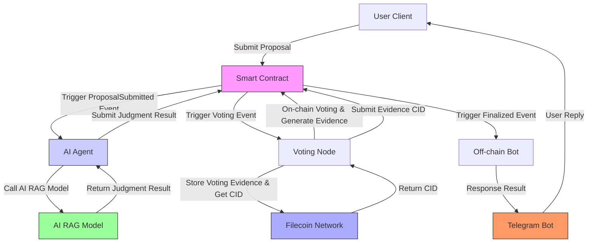

# TruthValidatorAgent

**Decentralized Information Verification System powered by AI Agent, Trusted Storage and Blockchain.**

## Project Overview

TruthValidatorAgent is an open-source system designed to combat misinformation by providing a transparent and efficient way to verify information. It combines **smart contracts**, **AI Agents (AI RAG-based)**, and **on-chain voting** to assess the authenticity of user-submitted proposals.

Users submit proposals to blockchain smart contracts through **robots**. The system then:

1. **Analyzes with AI:** An AI Agent uses Retrieval-Augmented Generation (RAG) to analyze the proposal and generate a preliminary judgment.
2. **Verifies by Community AI Agent:** The proposal is put to an **on-chain vote** for community consensus.
3. **Delivers Transparent Results:** Voting outcomes are recorded on the blockchain and communicated back to users via the robots.
4. **Stores Evidence on Filecoin:All voting evidence is decentralized and securely stored on the Filecoin network, ensuring data integrity and availability.** 

**Core Values:**

* **Enhanced Credibility:** Reduces misinformation spread.
* **Strengthened Trust:** Provides transparent verification.
* **Reduced Costs:** Automates verification using AI and community.
* **Data Integrity:** Ensures evidence is tamper-proof and accessible via **Filecoin**.
* **User Privacy:** Utilizes decentralized blockchain.
* **Community Governance:** Empowers community participation in verification.

**Key Applications:**

* Social Media Rumor Debunking
* News Verification
* E-commerce Anti-Counterfeiting
* Public Affairs Clarification
* Academic Research Validation

## System Architecture

**Components:**

* **Smart Contract (Solidity):** Manages proposals and voting on EVM blockchains.
* **AI Agent (Golang):** Uses RAG-based analysis for judgment and participates in voting.
* **AI Search Module (Golang):** Retrieves web information using SearxNG.
* **Telegram Bot (Golang):** Serves as the user interface for submissions and results.
* **Filecoin Storage:** Decentralized storage for voting evidence, ensuring data integrity and accessibility.

## Technologies

* **AI:** RAG, LLM, Metasearch API
* **Filecoin:** Decentralized storage for voting evidence
* **Blockchain:** EVM-compatible, Solidity, Web3 (go-ethereum)
* **Telegram Bot API:** `telegram-bot` (Golang)

## Integrating Filecoin into TruthValidatorAgent provides numerous benefits

* **Data Integrity:** Voting evidence is stored in a decentralized, tamper-proof manner.
* **Persistent Storage:** Ensures long-term availability of evidence, safeguarding against data loss.
* **Transparency:** Anyone can verify the authenticity of voting evidence via Filecoin's decentralized network.
* **Decentralized Governance:** Aligns with the system's philosophy of decentralization and community empowerment.
* **Enhanced Security:** Protects against censorship and single-point failures.

## 🚀Join us in building a more trustworthy information ecosystem!