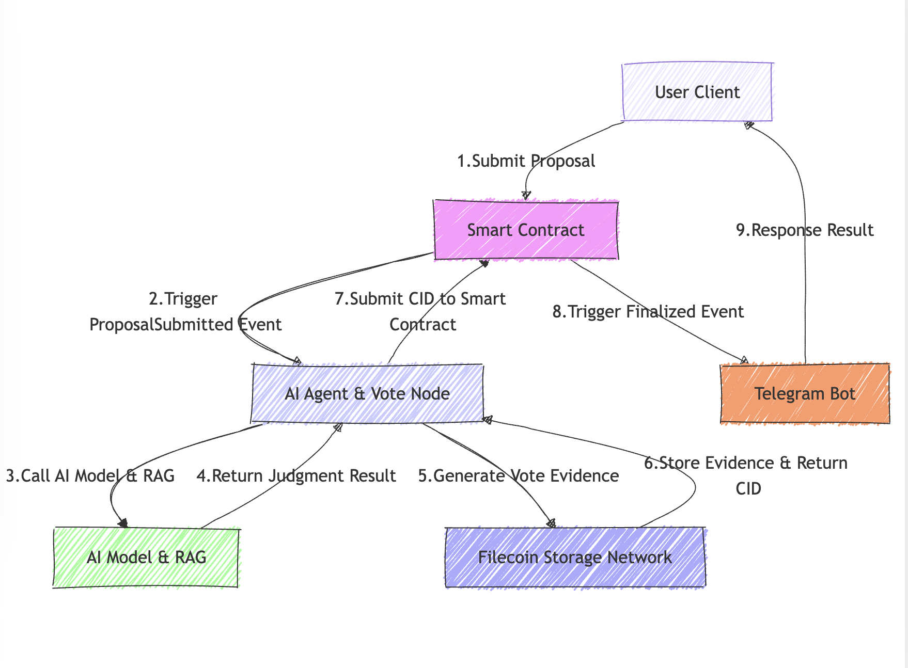
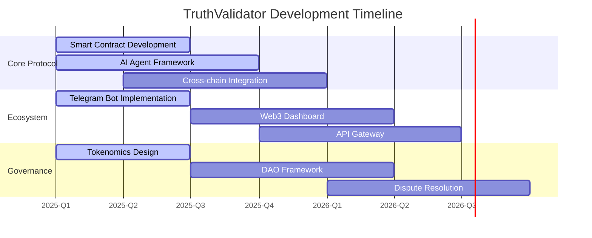

# TruthValidator - Guardians of Digital Truth

**A Decentralized Truth Verification Protocol for the Post-Information Age**

## 🌍 Our Mission

In an era of rampant misinformation, TruthValidator stands as a beacon of hope - a decentralized protocol that empowers humanity to collectively safeguard information sovereignty. We're building the infrastructure for a world where truth is verified, not dictated; where information integrity is protected by technology, not compromised by it.

This open-source project represents a radical reimagining of how society establishes truth - through the combined power of:
- **Decentralized AI** that analyzes without bias
- **Blockchain consensus** that verifies without central authority  
- **Community governance** that empowers without exclusion
- **Immutable storage** that preserves without alteration

## Project Overview

TruthValidator is more than software - it's a movement. This open-source protocol provides:
- A **decentralized verification network** where no single entity controls the truth
- **AI-powered analysis** that detects patterns and manipulations invisible to humans
- **Community governance** where verification power belongs to the people
- **Tamper-proof evidence storage** via IPFS/Filecoin's decentralized network

By combining cutting-edge technologies with radical transparency, we're creating an antidote to the misinformation pandemic.

Users submit proposals to blockchain smart contracts through **robots**. The system then:

1. **Analyzes with AI:** An AI Agent uses Retrieval-Augmented Generation (RAG) to analyze the proposal and generate a preliminary judgment.
2. **Verifies by Community AI Agent:** The proposal is put to an **on-chain vote** for community consensus.
3. **Delivers Transparent Results:** Voting outcomes are recorded on the blockchain and communicated back to users via the robots.
4. **Stores Evidence on Filecoin:All voting evidence is decentralized and securely stored on the Filecoin network, ensuring data integrity and availability.** 

**Core Values:**

* **Information Sovereignty:** Truth belongs to humanity, not corporations or governments
* **Radical Transparency:** Every verification is open, auditable and community-driven  
* **Technological Empowerment:** AI augments human judgment without replacing it
* **Decentralized Resilience:** No single point of failure or control
* **Open Participation:** Anyone can contribute, verify, or benefit
* **Immutable History:** Evidence preserved forever on decentralized storage

**Transforming How Society Establishes Truth:**

* **Democratizing Fact-Checking:** Community-powered verification for social media
* **News Integrity:** Cryptographic proof for journalistic claims  
* **Marketplace Trust:** Authenticity verification for e-commerce
* **Public Discourse:** Tamper-proof records for civic information
* **Academic Rigor:** Decentralized validation of research claims
* **Historical Preservation:** Immutable records of significant events

## System Architecture

**Components:**

* **Smart Contract (Solidity):** Manages proposals and voting on EVM blockchains.
* **Filecoin storage and retrieval(Filecoin lassie & Storacha):** Decentralized storage for voting evidence, ensuring data integrity and accessibility.
* **AI Agent (Golang):** Uses RAG-based analysis for judgment and participates in voting.
* **AI Search Module (Golang):** Retrieves web information using SearxNG.
* **Telegram Bot (Golang):** Serves as the user interface for submissions and results.

## Technologies

* **AI:** RAG, LLM, Metasearch API
* **Filecoin:** Decentralized storage for voting evidence(Filecoin lassie & Storacha)
* **Blockchain:** EVM-compatible chains (Filecoin, Ethereum, Polygon), Solidity smart contracts
* **Telegram Bot API:** `telegram-bot` (Golang)

## Integration with Filecoin storage

* **Data Integrity:** Voting evidence is stored in a decentralized, tamper-proof manner.
* **Persistent Storage:** Ensures long-term availability of evidence, safeguarding against data loss.
* **Transparency:** Anyone can verify the authenticity of voting evidence via Filecoin's decentralized network.
* **Decentralized Governance:** Aligns with the system's philosophy of decentralization and community empowerment.
* **Enhanced Security:** Protects against censorship and single-point failures.

## 📈 Technical Roadmap

## 🤝 Contributing

We welcome contributions from developers, researchers, and truth-seekers worldwide. Here's how you can help:

1. **Code Contributions**:
   - Fork the repository
   - Create a feature branch (`git checkout -b feature/AmazingFeature`)
   - Commit your changes (`git commit -m 'Add some AmazingFeature'`)
   - Push to the branch (`git push origin feature/AmazingFeature`)
   - Open a Pull Request

2. **Testing & Bug Reports**:
   - Test the system and report issues
   - Help improve test coverage

3. **Documentation**:
   - Improve existing docs
   - Add tutorials and examples

See our [Contribution Guidelines](CONTRIBUTING.md) for more details.

## ✊ Join the Truth Revolution

This is more than code - it's the foundation for a new information age. We invite developers, researchers, and truth-seekers worldwide to contribute to this open-source movement. Together, we can build:

- A world where information can be trusted by design
- Systems that empower rather than manipulate  
- Technology that serves truth rather than power

**The future of truth is decentralized. The future is open source. The future is ours to build.**

🔗 [Contribute on GitHub](https://github.com/TruthValidator)
📜 [Read the Lightpaper](./docs/lightpaper.md)

## 📜 License
TruthValidator is dual-licensed under:
- [Apache License 2.0](./LICENSE-APACHE)
- [MIT License](./LICENSE-MIT)
