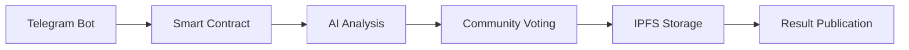

# TruthValidator Smart Contract & Voting System

## ⛓️ The Decentralized Truth Consensus Layer

At the heart of TruthValidator lies this open-source smart contract system - a revolutionary approach to establishing truth through decentralized consensus. This component enables:

- **Community-Powered Verification:** On-chain voting for truth determination
- **AI-Assisted Judgments:** Smart contracts that integrate AI analysis
- **Tamper-Proof Records:** Immutable blockchain storage of all decisions
- **Transparent Governance:** Fully auditable verification processes

## 🗳️ How Decentralized Truth Verification Works

1. **Proposal Submission:** Users submit claims via Telegram bot
2. **AI Preliminary Analysis:** AI Agent provides initial assessment
3. **Community Voting:** Token holders vote on claim validity
4. **Consensus Recording:** Results permanently stored on blockchain
5. **Evidence Archiving:** All supporting materials stored on IPFS/Filecoin

## 🏗️ Technical Architecture

**Core Components:**
- **EVM-Compatible Smart Contracts:** TruthValidatorSentientNet.sol (deployable on Filecoin, Ethereum, Polygon)
- **Golang AI Agent:** Integrates AI judgment with blockchain
- **IPFS/Filecoin Bridge:** For evidence storage
- **Telegram Bot Interface:** User interaction layer

## 🌱 Contributing to Decentralized Governance

We welcome contributions to:
- Improve voting mechanisms
- Enhance smart contract security
- Develop new consensus models
- Build better integration with AI components

**Help us create a future where truth is determined by the people, for the people.**

🔗 [Smart Contract Documentation]()
📜 [Voting Protocol Specs]()
🛡️ [Security Guidelines]()

## 📜 License
Dual-licensed under:
- [Apache 2.0](../LICENSE-APACHE)
- [MIT](../LICENSE-MIT)
