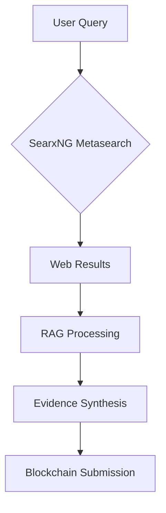

# TruthValidator AI Search Module

## 🔍 The Neural Engine of Decentralized Truth

The AI Search module is the cognitive core of TruthValidator - an open-source, decentralized intelligence system that powers our truth verification protocol. Combining cutting-edge AI with blockchain transparency, this module provides:

- **Unbiased Information Retrieval:** Searches across decentralized sources without algorithmic bias
- **RAG-Powered Analysis:** Uses Retrieval-Augmented Generation to contextualize and verify claims
- **Transparent Reasoning:** All search processes and results are verifiable and auditable
- **Community-Trainable Models:** AI that improves through decentralized contributions

## 🌐 How It Powers Truth Verification

1. **Decentralized Crawling:** Pulls information from multiple independent sources via SearxNG metasearch
2. **Contextual Understanding:** Uses LLMs to analyze relationships between claims and evidence
3. **Evidence Generation:** Creates verifiable reports with cryptographic proofs
4. **On-Chain Integration:** Prepares analysis for community voting on blockchain

## 🛠️ Technical Architecture

**Key Components:**
- **SearxNG Integration:** Decentralized search aggregator
- **RAG Pipeline:** Retrieval-Augmented Generation for evidence analysis
- **IPFS Storage:** All search evidence stored immutably on Filecoin
- **Smart Contract Interface:** Seamless blockchain integration

## 🤝 Contributing to Decentralized AI

We welcome contributions to advance decentralized truth verification:
- Improve search algorithms
- Enhance RAG capabilities
- Develop new evidence analysis models
- Strengthen blockchain integration

**Join us in building AI that serves truth, not power.**

🔗 [Contribution Guidelines]()

## 📜 License
Dual-licensed under:
- [Apache 2.0](../LICENSE-APACHE) 
- [MIT](../LICENSE-MIT)
