# **TruthValidator: 去中心化真相验证协议**  
**基于AI、区块链与Filecoin的抗篡改信息验证网络**  

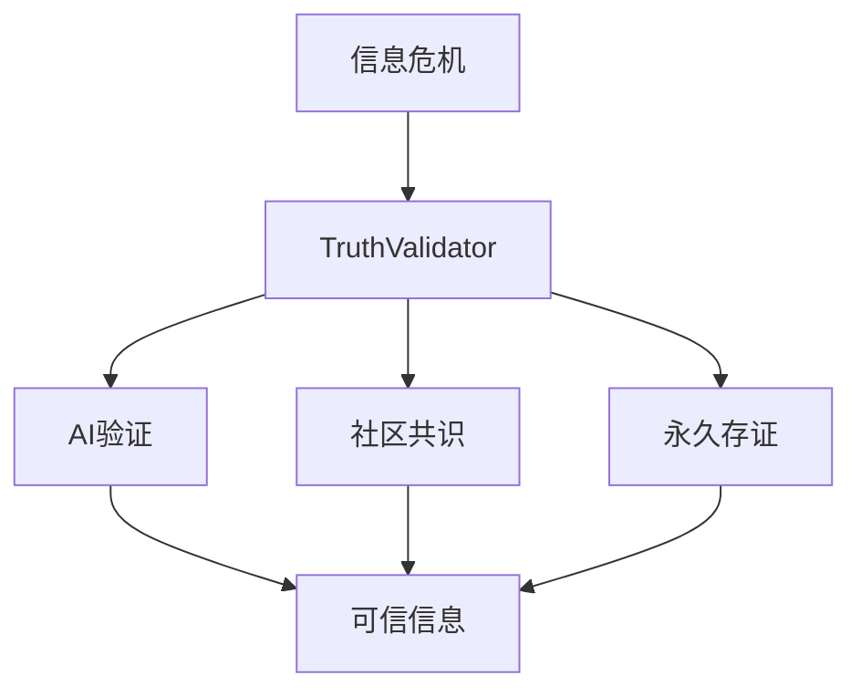

## **1. 摘要（Executive Summary）**
TruthValidator 是Web3时代的信息验证基础设施，通过三重机制确保数字真相：

1. **智能分析** - RAG增强的AI验证引擎
2. **集体智慧** - DAO驱动的社区投票
3. **永久记录** - Filecoin存储的不可篡改证据

## **2. 问题与现状**
### **2.1 信息生态危机**
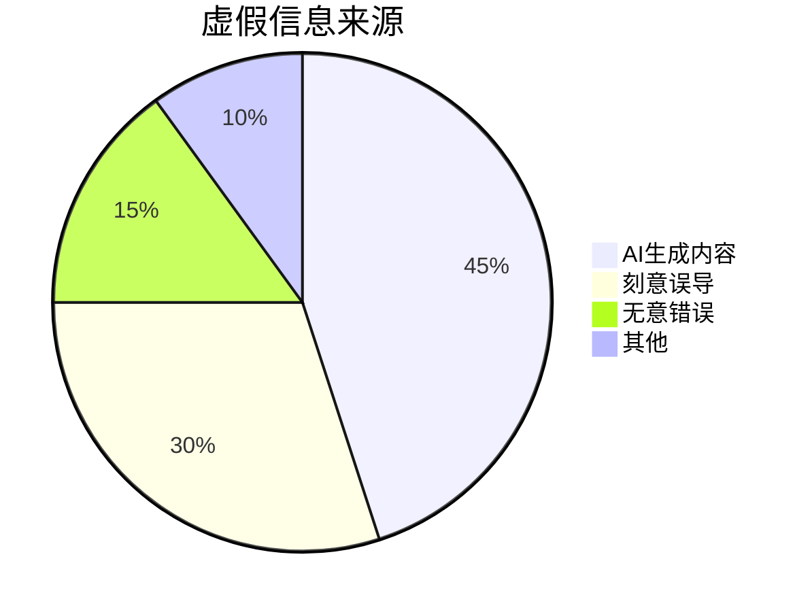

### **2.2 传统方案缺陷**
| 方案 | 问题 | 我们的改进 |
|------|------|-----------|
|人工审核|效率低、成本高|AI自动化验证|
|中心化平台|单点控制风险|去中心化网络|
|简单存证|缺乏分析|完整验证链|

## **3. 技术架构**
### **3.1 系统概览**
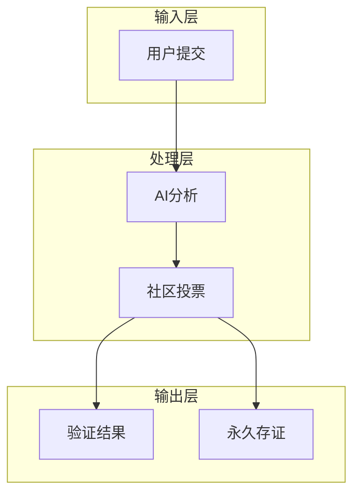

### **3.2 核心创新**
**1. AI验证引擎**
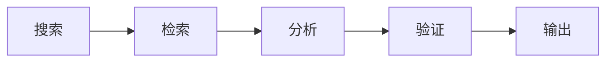

**2. 共识机制**
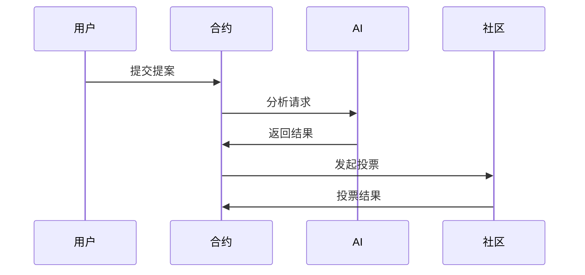

**3. 存储系统**
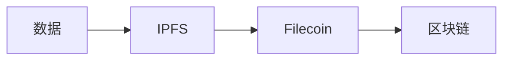

## **4. 技术实现**
### **4.1 模块详解**
**智能合约**
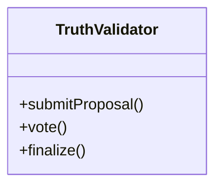

**AI工作流**
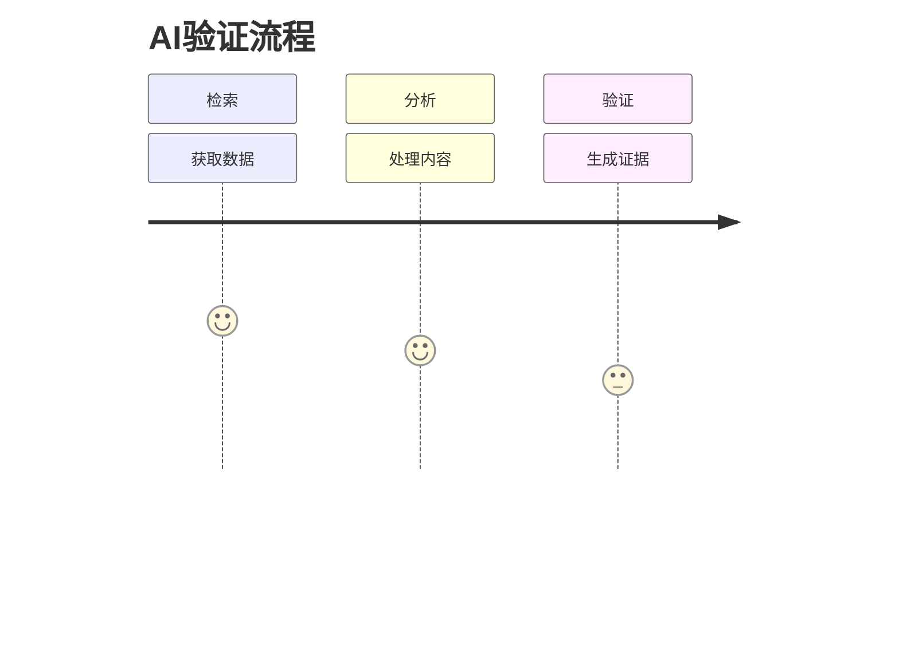

### **4.2 关键技术**
- 多模态内容分析
- 去中心化身份认证
- 零知识证明隐私保护
- 跨链互操作性

## **5. 应用场景**
### **5.1 典型用例**
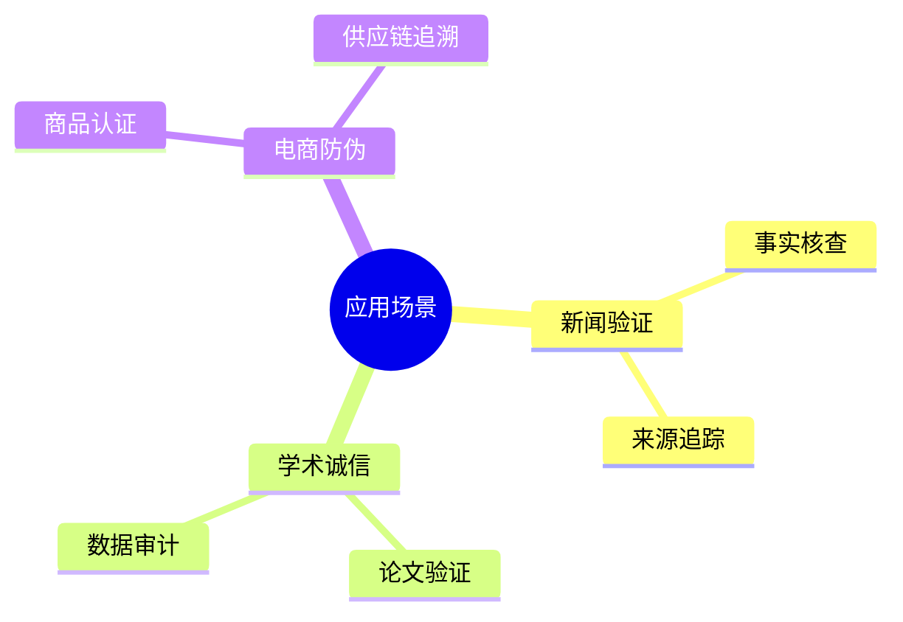

## **6. 生态发展**
### **6.1 路线图**
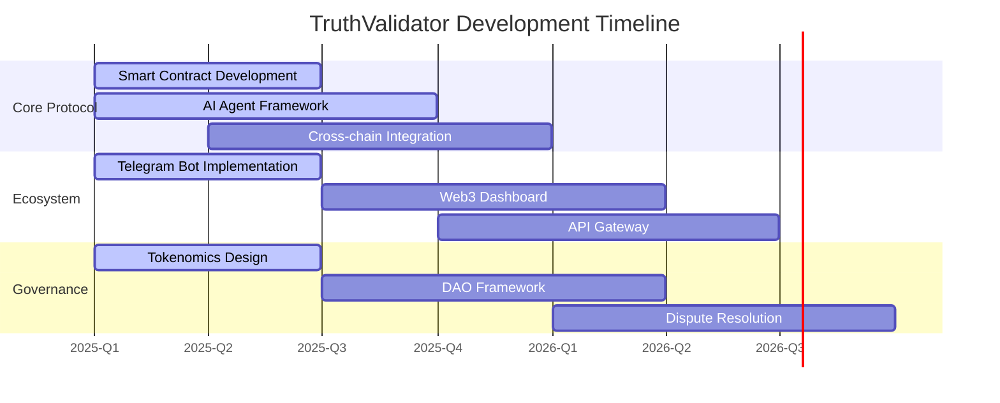

## **7. 总结展望**
**技术价值**
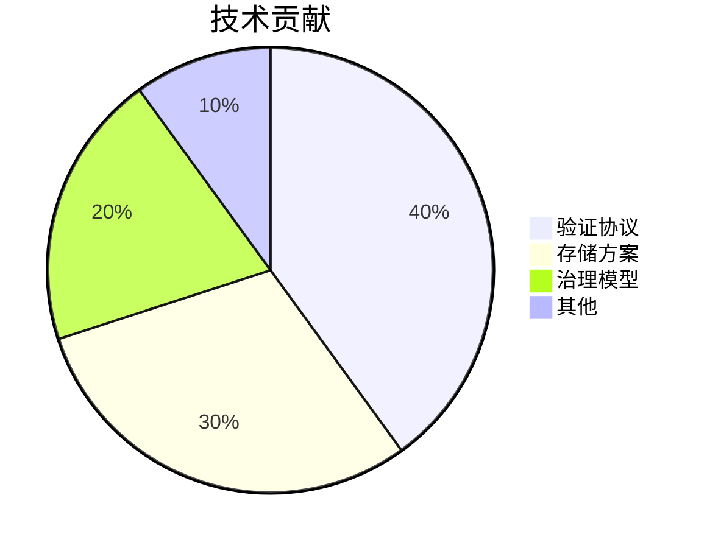

**未来方向**
- 多链验证网络
- 增强隐私保护
- 开放标准制定

> "构建信息可信互联网的基础协议"

## **8. 参与方式**
- 开发者: GitHub贡献
- 研究者: 模型优化
- 用户: 运行节点

[官网] | [文档] | [社区]