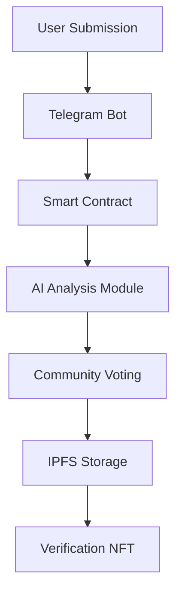

# TruthValidator Lightpaper  
**Decentralized Truth Verification for the Information Age**  
*Version 1.0 - March 2025*

## 🌐 Vision
In a world drowning in misinformation, TruthValidator pioneers a decentralized protocol where:
- **Truth is verified, not dictated**  
- **AI serves humanity, not manipulates it**  
- **Information sovereignty belongs to the people**

## 🔍 Core Problem
- 74% of internet users encounter misinformation weekly (Pew Research 2024)  
- Centralized platforms control truth narratives  
- AI-generated content makes verification exponentially harder  

## 💡 Our Solution
A decentralized network combining:
- **AI Agents** for unbiased analysis  
- **Blockchain Consensus** for community verification  
- **IPFS/Filecoin** for immutable evidence storage  

### Key Innovations:
1. **RAG-Powered AI Verification**  
   - Retrieval-Augmented Generation analyzes claims against decentralized knowledge graphs  
   - Transparent reasoning trails stored on-chain  

2. **Token-Curated Truth**  
   - TVT token holders vote on claim validity  
   - Reputation-weighted quadratic voting prevents Sybil attacks  

3. **Decentralized Evidence Storage**  
   - All verification materials stored on IPFS/Filecoin  
   - Content-addressed cryptographic proofs  

## ⚙️ Technical Architecture

**Core Components:**
- **Smart Contracts:** Solidity (EVM-compatible: Filecoin, Ethereum, Polygon)  
- **AI Modules:** Go + Python (RAG/LLM)  
- **Storage:** IPFS/Filecoin  
- **Frontend:** Telegram Bot + Web3 Dashboard  

## 🗳️ Governance Model
Three-Layer Verification:
1. **AI First Pass** (RAG analysis)  
2. **Expert Review** (Subject matter delegates)  
3. **Community Vote** (TVT token holders)  

## 📈 Roadmap
| Quarter | Milestone |
|---------|-----------|
| Q2 2025 | MVP Launch (Filecoin, Ethereum, Polygon) |  
| Q3 2025 | Cross-Chain Verification |  
| Q4 2025 | Decentralized AI Training |  
| Q1 2026 | DAO Governance Transition |  

## 🌱 Join the Movement
**For Developers:**
- Contribute to our [GitHub](https://github.com/TruthValidator)  
- Build verification plugins  

**For Researchers:**  
- Improve our RAG models  
- Study decentralized consensus mechanisms  

**For Everyone:**  
- Run verification nodes  
- Participate in truth mining  

**The future of truth is decentralized.**  
**The future is verifiable.**  
**The future starts now.**  

📄 [Full Whitepaper]() | 🤖 [Try Our Bot]() | 🌐 [Join Community]()
