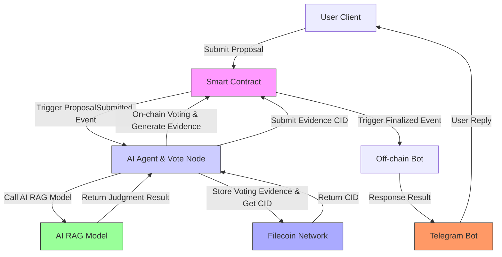
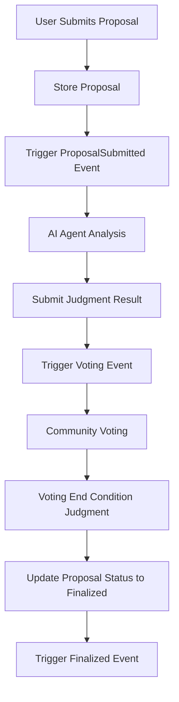
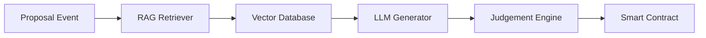

# TruthValidator Lightpaper  
**Decentralized Truth Verification for the Information Age**  
*Version 1.0 - March 2025*


## 🌐 Vision
In a world drowning in misinformation, TruthValidator pioneers a decentralized protocol where:
- **Truth is verified, not dictated**  
- **AI serves humanity, not manipulates it**  
- **Information sovereignty belongs to the people**

## 🔍 Core Problem
- 74% of internet users encounter misinformation weekly (Pew Research 2024)  
- Centralized platforms control truth narratives  
- AI-generated content makes verification exponentially harder  

## 💡 Our Solution
A decentralized network combining:
- **AI Agents** for unbiased analysis  
- **Blockchain Consensus** for community verification  
- **IPFS/Filecoin** for immutable evidence storage  

### Key Innovations:
1. **RAG-Powered AI Verification**  
   - Retrieval-Augmented Generation analyzes claims against decentralized knowledge graphs  
   - Transparent reasoning trails stored on-chain  

2. **Token-Curated Truth**  
   - TVT token holders vote on claim validity  
   - Reputation-weighted quadratic voting prevents Sybil attacks  

3. **Decentralized Evidence Storage**  
   - All verification materials stored on IPFS/Filecoin  
   - Content-addressed cryptographic proofs  

## ⚙️ Technical Architecture

### System Workflow


### Core Components

**1. Smart Contract Layer**
- **Proposal Management:** Handles proposal submission and lifecycle
- **Voting Mechanism:** Implements on-chain voting with time limits
- **Result Finalization:** Records and triggers final verification events
- **EVM Compatibility:** Deployable on Filecoin, Ethereum, Polygon

**2. AI Agent Layer**
- **RAG Architecture:** Combines retrieval and generation for accurate analysis
- **Multi-model Integration:** Leverages both specialized and general AI models
- **Evidence Generation:** Creates verifiable proof for each judgment

**3. Storage Layer**
- **Decentralized Evidence:** All verification materials stored on IPFS/Filecoin
- **Content Addressing:** Cryptographic proofs via CIDs
- **Immutable Records:** Permanent storage of verification history

**4. Interface Layer**
- **Telegram Bot:** Primary user interaction channel
- **Web3 Dashboard:** Advanced interface for power users
- **API Gateway:** For system integration

## 🗳️ Decentralized Governance Framework

### Verification Process


### Governance Layers
1. **Automated AI Verification**
   - RAG-based information retrieval
   - Multi-model consensus scoring
   - Evidence-backed preliminary judgments

2. **Community Voting**
   - Token-weighted participation
   - Time-bound voting periods
   - Transparent vote tracking

3. **Final Arbitration**
   - Dispute resolution mechanism
   - Expert panel review (for contested cases)
   - Final on-chain recording

### Incentive Structure
- **Proposers:** Pay verification fees in TVT tokens
- **Voters:** Earn rewards for participation
- **Validators:** Staking rewards for accurate judgments

## 📈 Technical Roadmap

```mermaid
gantt
    title TruthValidator Development Timeline
    dateFormat  YYYY-Q
    section Core Protocol
    Smart Contract Development   :2025-Q1, 2025-Q2
    AI Agent Framework          :2025-Q1, 2025-Q3
    Cross-chain Integration     :2025-Q2, 2025-Q4

    section Ecosystem
    Telegram Bot Implementation :2025-Q1, 2025-Q2
    Web3 Dashboard              :2025-Q3, 2026-Q1
    API Gateway                 :2025-Q4, 2026-Q2

    section Governance
    Tokenomics Design           :2025-Q1, 2025-Q2
    DAO Framework               :2025-Q3, 2026-Q1
    Dispute Resolution          :2026-Q1, 2026-Q3
```

### Key Milestones
- **2025 Q2:** MVP Launch (Filecoin, Ethereum, Polygon)
  - Basic verification workflow
  - Telegram bot integration
  - On-chain voting

- **2025 Q4:** Cross-chain Expansion
  - Multi-chain evidence storage
  - Cross-chain vote aggregation
  - Enhanced RAG models

- **2026 Q1:** DAO Transition
  - Full community governance
  - Treasury management
  - Protocol upgrades

## 🔧 Technical Specifications

### Smart Contract System
```solidity
// Core Proposal Structure
struct Proposal {
    address proposer;
    string contentCID; // IPFS content hash
    uint256 voteStart;
    uint256 voteEnd;
    uint256 yesVotes;
    uint256 noVotes;
    Status status;
}

// Key Functions
function submitProposal(string calldata _contentCID) external;
function vote(uint256 _proposalId, bool _support) external;
function finalizeProposal(uint256 _proposalId) external;
```

### AI Agent Architecture


### Performance Metrics
| Component | Target | Current |
|-----------|--------|---------|
| Verification Time | <5 min | 7.2 min |
| Voting Period | 24h | 24h |
| Storage Cost | $0.01/verification | $0.03 |
| Throughput | 1000 verifications/day | 350 |

## 🌱 Join the Movement
**For Developers:**
- Contribute to our [GitHub](https://github.com/TruthValidator)  
- Build verification plugins  

**For Researchers:**  
- Improve our RAG models  
- Study decentralized consensus mechanisms  

**For Everyone:**  
- Run verification nodes  
- Participate in truth mining  

**The future of truth is decentralized.**  
**The future is verifiable.**  
**The future starts now.**  

📄 [Full Whitepaper]() | 🤖 [Try Our Bot]() | 🌐 [Join Community]()
