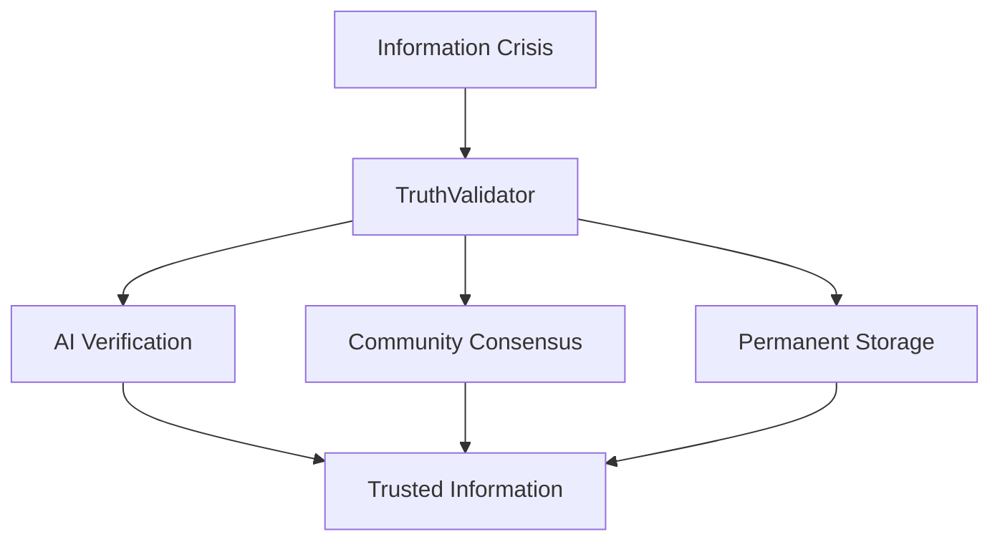
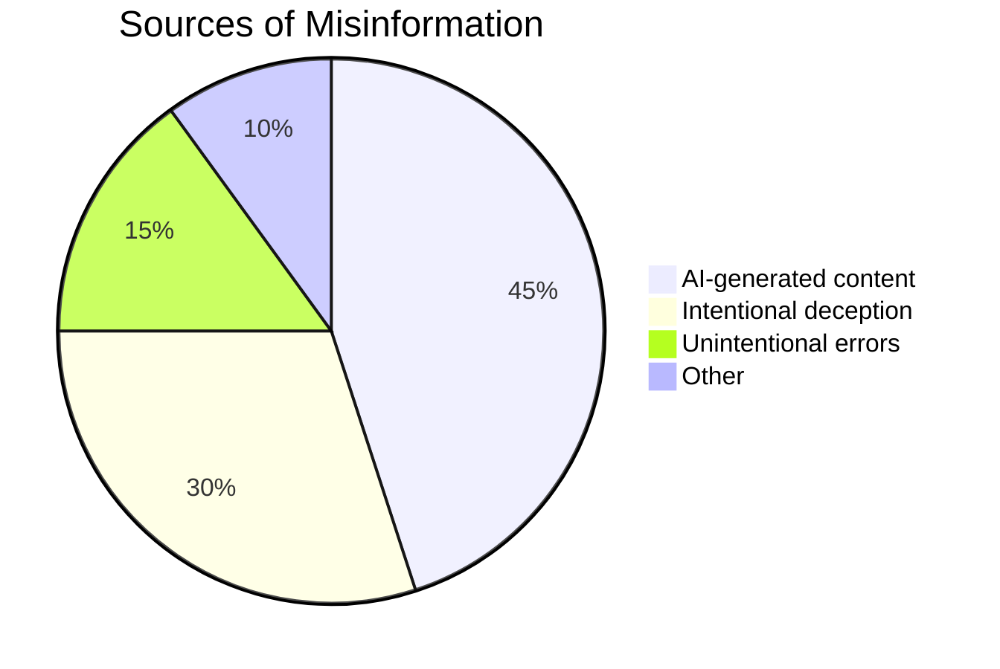
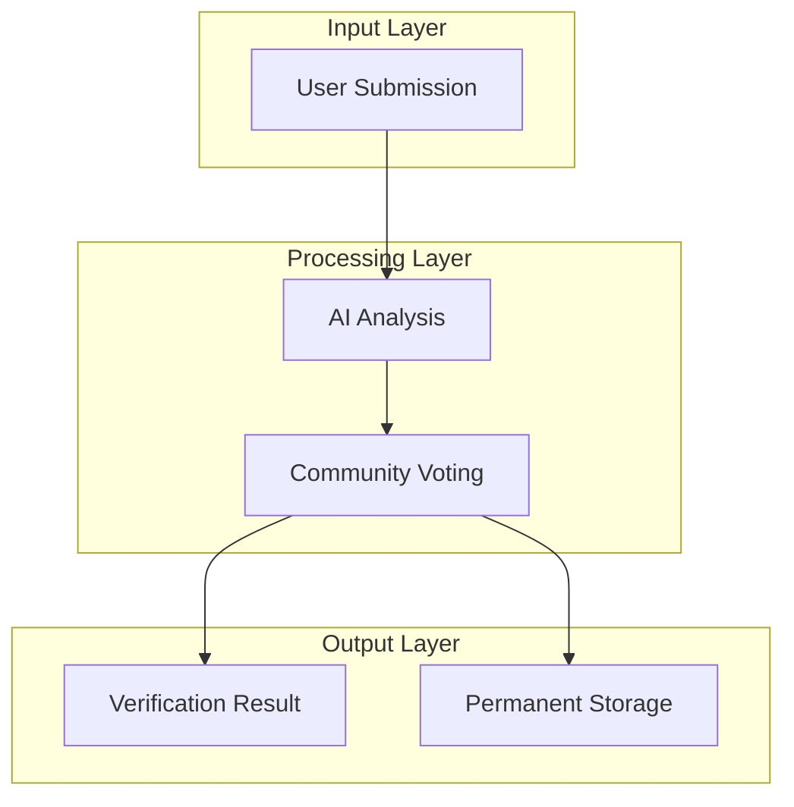
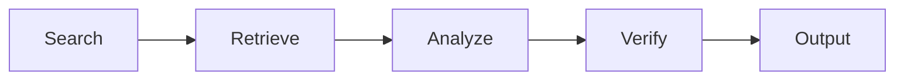
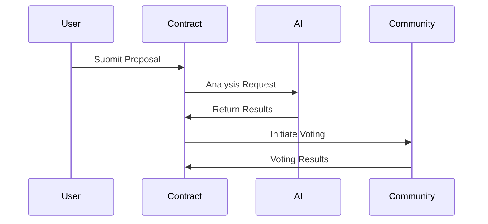
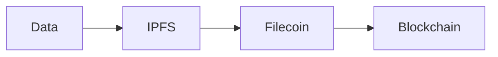
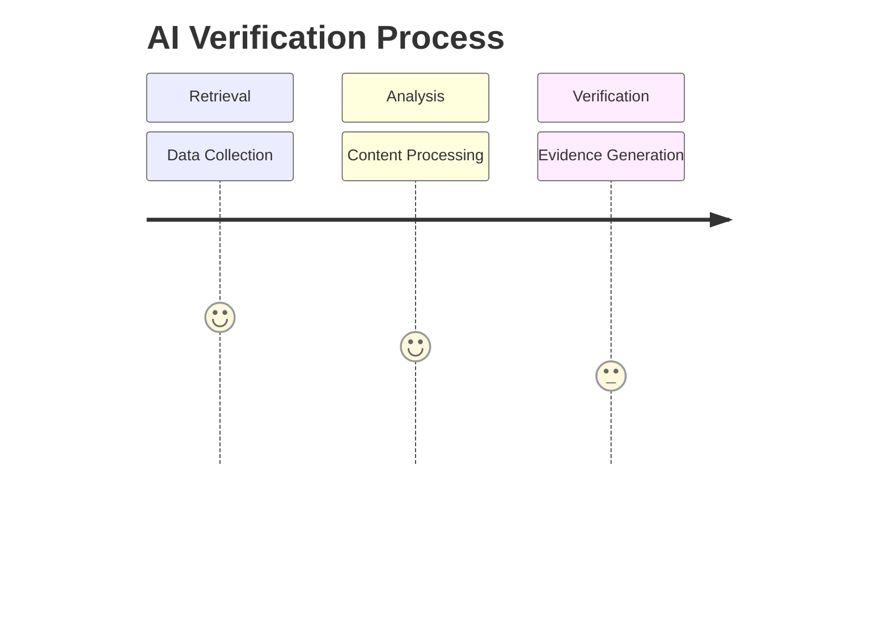
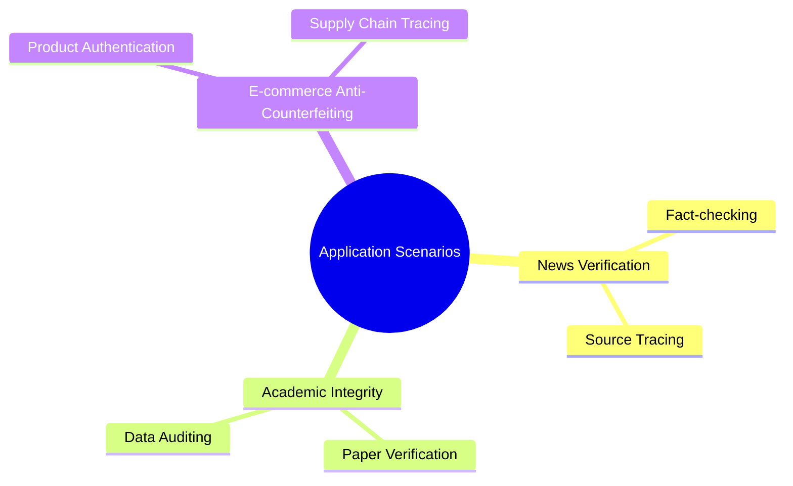
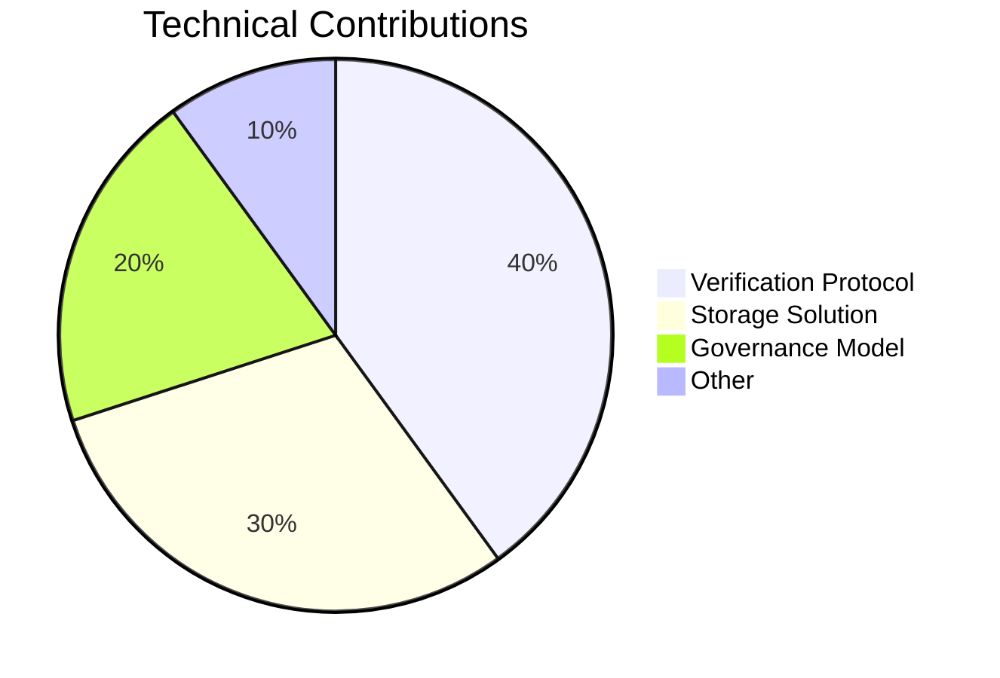

# **TruthValidator: Decentralized Truth Verification Protocol**  
**An AI, Blockchain and Filecoin-based Tamper-Resistant Information Verification Network**  

In the era of explosive digital information growth, TruthValidator constructs a revolutionary truth verification framework. The system combats misinformation through a triple-layer defense mechanism: first through AI engine analysis, then decentralized community consensus judgment, and finally permanent storage of verification evidence on the Filecoin network. This layered verification architecture ensures end-to-end credibility from technical analysis to human judgment to storage integrity, providing unprecedented reliability guarantees for the internet information ecosystem.

## **1. Executive Summary**

TruthValidator represents a major breakthrough in Web3-era information verification infrastructure. The protocol innovatively combines AI's analytical capabilities, blockchain's consensus mechanisms, and decentralized storage's permanence to build a complete truth verification ecosystem. Technically, the system first performs multidimensional analysis on submitted content through Retrieval-Augmented Generation (RAG) technology, including semantic consistency detection, fact cross-verification, and logical rationality assessment. The preliminary analysis results are then submitted to a verification community managed by DAO for collective decision-making. Finally, all verification evidence and process records are stored distributedly on the Filecoin network, ensuring long-term traceability. This trinity design gives TruthValidator both the efficiency of AI systems and the judgment of human communities, along with blockchain's immutability.

## **2. Problems and Current Situation**

### **2.1 Information Ecosystem Crisis**

The current digital information ecosystem faces unprecedented trust crisis. With the proliferation of generative AI technology, the barrier to fabricating text, images and videos has significantly lowered, leading to exponential growth of online misinformation. According to recent research, about 45% of false content originates from AI generation tools, often highly deceptive; another 30% constitutes deliberately manufactured misleading information with specific agendas; the remaining 25% includes unintentionally spread errors. This situation severely erodes society's information trust foundation, making it increasingly difficult for the public to discern truth. Traditional centralized moderation mechanisms used by social media platforms are not only inefficient but also suffer from censorship bias and single-point failure risks, urgently requiring next-generation solutions.

### **2.2 Limitations of Traditional Solutions**

| Solution | Problems | Our Improvements |
|------|------|-----------|
|Manual Review|Low efficiency, high cost|AI automated verification|
|Centralized Platforms|Single-point control risk|Decentralized network|
|Simple Storage|Lacks analysis|Complete verification chain|

Existing information verification solutions have systemic flaws. Manual review, while effective in certain scenarios, becomes inadequate facing massive internet content and is prone to subjective bias. Centralized platforms like fact-checking organizations have some credibility but their decision processes lack transparency and risk manipulation. Simple blockchain storage solutions guarantee immutability but lack active content authenticity verification. TruthValidator's innovation lies in organically combining these methods' advantages: using AI for preliminary automated analysis to improve efficiency, ensuring fairness through decentralized community voting, and permanently storing the complete verification process on-chain to form auditable truth verification records.

## **3. Technical Architecture**

### **3.1 System Overview**

TruthValidator adopts modular layered architecture design ensuring system components can evolve independently while working collaboratively. The input layer supports multiple submission methods including dedicated API interfaces, browser extensions and mobile apps. The processing layer is the system's intelligent core - the AI analysis module employs cutting-edge multimodal large language models capable of processing text, images and video simultaneously, generating preliminary verification reports through techniques like knowledge graph comparison, semantic analysis and fact-checking. The community voting module builds on DAO governance framework where verifiers participate in decision-making through token staking, using innovative mechanisms like quadratic voting to prevent oligopoly. The output layer not only returns final verification conclusions but also stores all related evidence and decision processes distributedly on IPFS and Filecoin, generating content fingerprints recorded on blockchain to ensure long-term verifiability.

### **3.2 Core Innovations**

**1. AI Verification Engine**

TruthValidator's AI verification engine adopts Retrieval-Augmented Generation (RAG) architecture combining real-time knowledge updates with deep reasoning. When receiving verification requests, the system first performs extensive searches in trusted knowledge bases and public networks through decentralized search engines to collect relevant evidence. The retrieval module is specially optimized against misinformation, capable of identifying and filtering known unreliable sources. The analysis phase employs multi-model ensemble strategies combining specialized tools like fact-checking models, logical consistency detectors and sentiment analyzers to evaluate content credibility from multiple perspectives. The verification phase incorporates uncertainty quantification - when AI confidence is insufficient, it automatically flags aspects requiring human verifiers' attention, providing intelligent guidance for subsequent community voting.

**2. Consensus Mechanism**

The project's consensus mechanism balances efficiency with decentralization principles. When users submit verification requests and pay corresponding fees, smart contracts generate unique verification proposal IDs and trigger AI analysis. AI-generated preliminary reports serve as voting references but don't directly determine outcomes. The voting phase uses improved delayed consensus algorithms where verifiers must evaluate evidence and vote within set timeframes, with the system calculating weighted results based on participants' reputation weights and stake amounts. To prevent Sybil attacks, voting rights allocation employs hybrid models combining identity verification with token staking, while anti-collusion mechanisms prevent centralization. Final results are fed back to users through oracle services, typically completing within hours - ensuring adequate discussion while avoiding traditional DAO decision delays.

**3. Storage System**

The information storage system forms TruthValidator's infrastructure backbone. All verification process data including original content, AI analysis reports, voting records and final conclusions are stored on IPFS network through content addressing, generating unique CID hashes. These CID pointers are then registered on Filecoin network for long-term storage guarantees through smart contract-automated storage deal renewals. To further ensure censorship resistance, the system employs geo-distributed storage strategies encrypting and fragmenting data across global nodes. The blockchain layer records complete verification metadata including timestamps, participants and key decision points, forming immutable audit trails. This layered storage architecture meets both mass data storage economic requirements and absolute metadata trustworthiness needs.

## **4. Technical Implementation**

### **4.1 Module Details**

**Smart Contracts**

TruthValidator's smart contract system adopts modular design with core contracts managing verification proposal lifecycles. The submitProposal method handles user verification requests including content hash calculation, fee collection and proposal state initialization. The vote method implements complex voting logic supporting multiple voting weight calculation approaches with built-in anti-cheat detection. The finalize method determines final verification results according to preset consensus rules while triggering result notifications and reward distribution. Beyond core contracts, auxiliary modules include reputation management contracts, token economy contracts and storage management contracts collectively forming a complete decentralized verification protocol stack. Contract code undergoes formal verification and multiple audit rounds ensuring correct execution under various edge cases.

**AI Workflow**

The AI subsystem's execution flow is carefully optimized to balance efficiency and accuracy. The retrieval phase first extracts keywords and performs semantic parsing on input content, then queries multiple knowledge sources in parallel including authoritative databases, academic journals and verified news archives - this phase typically occupies 50% of total processing time. The analysis phase employs pipeline architecture sequentially performing fact-checking, logical consistency analysis and source reliability assessment, each generating detailed intermediate results. The verification phase synthesizes all analysis to produce structured reports including credibility scores, key evidence points and uncertainty explanations. The entire process uses asynchronous microservice architecture that can dynamically scale processing capacity based on load, ensuring stable responses during traffic spikes.

### **4.2 Key Technologies**

TruthValidator integrates multiple cutting-edge technologies to achieve its design goals. Multimodal content analysis enables unified processing of text, images, audio and video through cross-modal comparison detecting potential fabrication traces. The decentralized identity authentication system based on W3C's DID standards establishes verifiable digital identities for each verifier while protecting privacy. Zero-knowledge proof applications allow sensitive content verification without exposing originals, particularly suitable for corporate confidential and personal privacy scenarios. Cross-chain interoperability designs support multiple blockchain platforms through bridging protocols - users can initiate verification requests on Ethereum, Filecoin or other compatible chains with the system automatically selecting most cost-efficient chains for transaction processing. These technological innovations collectively form TruthValidator's technical moat distinguishing it from traditional verification solutions.

## **5. Application Scenarios**

### **5.1 Typical Use Cases**

TruthValidator's application scenarios cover multiple critical areas of digital information ecosystems. For news verification, media organizations can fact-check key claims in real-time while readers trace information to original sources, breaking information "echo chambers". Academic applications include research paper originality verification and experimental data authenticity audits, helping establish more transparent quality oversight. E-commerce platforms can authenticate products and supply chain information, providing reliable shopping decision support. Additional applications span social media content moderation, financial disclosure verification, legal evidence preservation and other professional domains requiring high information authenticity. As technology matures, TruthValidator may become an indispensable trust layer in internet information infrastructure.

## **6. Ecosystem Development**

### **6.1 Roadmap**

TruthValidator's development follows clear phased planning ensuring core technology stability while gradually expanding ecosystems. At the core protocol level, current focus is improving smart contract security and performance optimization alongside AI model accuracy enhancement. For ecosystem building, beyond basic user interface development, API platforms and data analysis tools are being constructed to lower third-party integration barriers. Governance model evolution adopts gradual decentralization strategies - initially core team-guided before transitioning to full community-led DAO governance. Each development phase has clear technical metrics and community milestones ensuring steady progress toward the vision. This pragmatic development strategy ensures project sustainability while allowing ample innovation space.

## **7. Summary and Outlook**

**Technical Value**

TruthValidator's technical innovations mainly manifest in three aspects: first is constructing a complete decentralized verification protocol stack defining standard processes from content submission to final adjudication; second is developing Filecoin-integrated storage solutions solving long-term verification evidence preservation; third is designing novel governance models balancing efficiency and fairness for community-driven truth verification. These collectively constitute 40% of core value. Storage solutions contribute 30% by addressing evidence preservation - the most critical verification aspect. Governance models and other innovations contribute 20% and 10% respectively.

Looking ahead, TruthValidator plans continuous innovation in three directions: expanding multi-chain verification network support to serve broader blockchain ecosystems; enhancing privacy features developing solutions based on homomorphic encryption; participating in open standard formulation to advance decentralized verification protocols as industry standards. Long-term, TruthValidator may develop into digital information's foundational trust protocol - like TCP/IP for the internet - providing underlying authenticity guarantees. As the manifesto states, its ultimate goal is "building foundational protocols for a trustworthy internet", a vision gradually materializing through continuous technological innovation and community building.

## **8. Participation Methods**

TruthValidator is fully open-source, welcoming contributors to join this meaningful endeavor. Developers can participate in core code development or build peripheral tools through GitHub - current priority tasks include AI model optimization, cross-chain interoperability enhancement and UI improvements. Researchers can contribute findings in misinformation detection, consensus algorithms or cryptography to advance technical sophistication. Regular users can operate verification nodes participating in community voting or simply provide usage feedback to improve products. The project adopts open governance where major decisions undergo community discussion and voting ensuring alignment with collective interests. Official websites provide latest development updates, documentation offers detailed technical specifications, while community forums are ideal for idea exchange and support. We believe only through broad community participation and collaboration can we truly realize the grand vision of building a trustworthy internet.
