# **TruthValidator: 去中心化真相验证协议**  
**基于AI、区块链与Filecoin的抗篡改信息验证网络**  

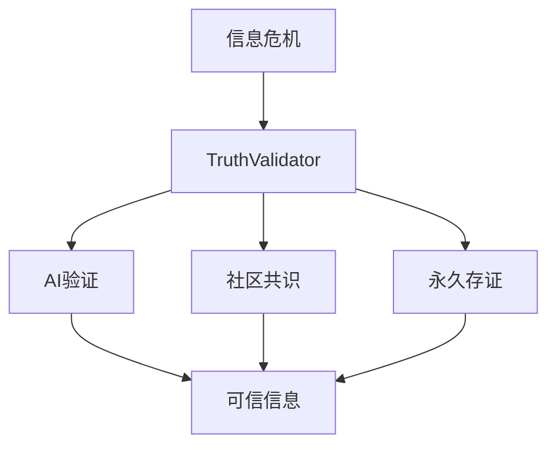

在数字信息爆炸式增长的时代，TruthValidator构建了一个革命性的真相验证框架。该系统通过三重防御机制对抗虚假信息：首先由AI引擎进行智能分析，再通过去中心化社区达成共识判断，最终将验证证据永久存储在Filecoin网络中。这种分层验证架构确保了从技术分析到人类判断再到存证完整性的全流程可信性，为互联网信息生态提供了前所未有的可靠性保障。

## **1. 摘要（Executive Summary）**

TruthValidator代表着Web3时代信息验证基础设施的重大突破。该协议创造性地将人工智能的智能分析能力、区块链的共识机制以及去中心化存储的永久性相结合，构建了一个完整的真相验证生态系统。在技术实现层面，系统首先通过检索增强生成（RAG）技术对提交内容进行多维度分析，包括语义一致性检测、事实交叉验证和逻辑合理性评估；随后将初步分析结果提交给由DAO组织管理的验证社区进行集体决策；最终所有验证证据和过程记录都将通过Filecoin网络进行分布式存储，确保信息的长期可追溯性。这种三位一体的设计使得TruthValidator既具备AI系统的高效性，又保持了人类社区的判断力，同时还拥有区块链技术的不可篡改性。

## **2. 问题与现状**

### **2.1 信息生态危机**

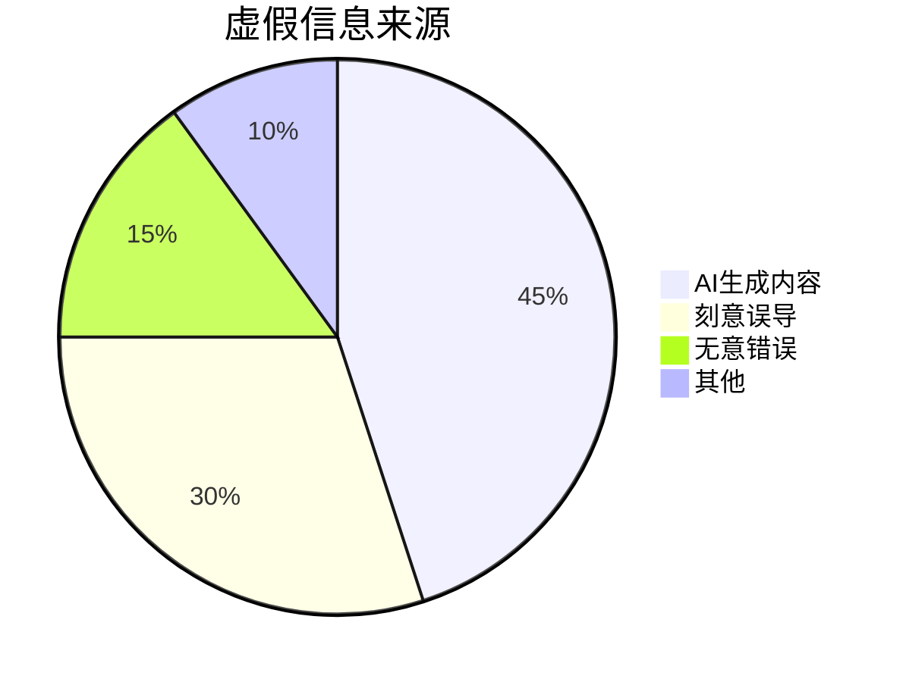

当前数字信息生态面临着前所未有的信任危机。随着生成式AI技术的普及，伪造文本、图像和视频的门槛大幅降低，导致网络虚假信息呈现指数级增长。根据最新研究，约45%的虚假内容源自AI生成工具，这些内容往往具有高度的迷惑性；另有30%属于人为刻意制造的误导信息，通常带有特定目的性；其余25%则包括无意传播的错误信息等。这种状况严重侵蚀了社会的信息信任基础，使得公众越来越难以辨别真相。传统社交媒体平台采用的集中式审核机制不仅效率低下，还存在审查偏见和单点故障风险，亟需新一代解决方案。

### **2.2 传统方案缺陷**

| 方案 | 问题 | 我们的改进 |
|------|------|-----------|
|人工审核|效率低、成本高|AI自动化验证|
|中心化平台|单点控制风险|去中心化网络|
|简单存证|缺乏分析|完整验证链|

现有信息验证方案存在系统性缺陷。人工审核虽然在某些场景下有效，但面对海量互联网内容时显得力不从心，且容易受到主观偏见影响。中心化平台如事实核查机构虽然具有一定公信力，但其决策过程不透明，存在被操控或施压的风险。简单的区块链存证方案虽然保证了信息不可篡改，但缺乏对内容真实性的主动验证能力。TruthValidator的创新之处在于将这些方法的优势有机结合：利用AI进行初步自动化分析提高效率，通过去中心化社区投票确保决策公正性，最后将完整验证过程永久上链保存，形成可审计的真相验证全记录。

## **3. 技术架构**

### **3.1 系统概览**

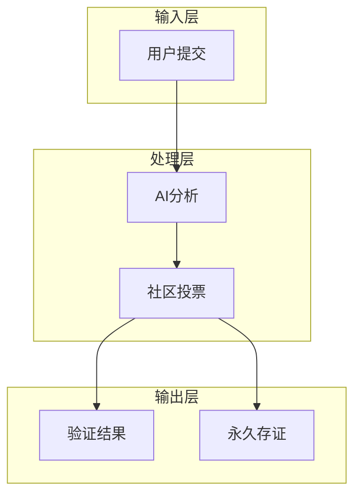

TruthValidator采用模块化分层架构设计，确保系统各组件既能独立演进又能协同工作。在输入层，系统支持多种提交方式，包括专门的API接口、浏览器插件和移动应用，用户可以通过这些渠道提交需要验证的内容。处理层是系统的智能核心，AI分析模块采用最新的多模态大语言模型，能够同时处理文本、图像和视频内容，通过知识图谱比对、语义分析和事实核查等多种技术手段生成初步验证报告。社区投票模块则构建在DAO治理框架之上，验证者通过质押代币参与决策，系统采用二次方投票等创新机制防止寡头垄断。输出层不仅返回最终的验证结论，还会将所有相关证据和决策过程通过IPFS和Filecoin进行分布式存储，生成内容指纹并记录在区块链上，确保长期可验证性。

### **3.2 核心创新**

**1. AI验证引擎**

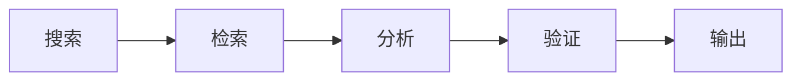

TruthValidator的AI验证引擎采用检索增强生成（RAG）架构，实现了知识实时更新与深度推理的结合。当接收到验证请求时，系统首先通过去中心化搜索引擎在可信知识库和公开网络中进行广泛检索，收集相关证据材料。检索模块特别优化了对抗虚假信息的能力，能够识别并过滤已知的不可靠信源。分析阶段采用多模型集成策略，结合事实核查模型、逻辑一致性检测器和情感倾向分析器等专业工具，从不同角度评估内容可信度。验证环节引入了不确定性量化技术，当AI系统对判断置信度不足时，会自动标记需要人类验证者重点关注的方面，为后续社区投票提供智能指引。

**2. 共识机制**

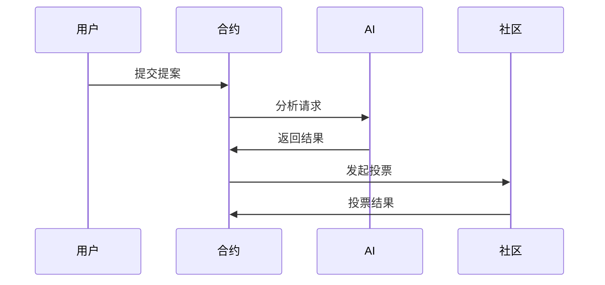

项目的共识机制设计平衡了效率与去中心化原则。当用户提交验证请求并支付相应费用后，智能合约会生成唯一的验证提案ID并触发AI分析流程。AI生成的初步报告将作为社区投票的参考依据，但不会直接决定最终结果。投票阶段采用改良的延迟共识算法，验证者需要在一定时间内评估证据并投票，系统根据参与者的信誉权重和质押数量计算加权结果。为了防止女巫攻击，投票权分配采用了基于身份验证和代币质押的混合模型，同时引入反勾结机制防止投票权集中化。最终结果将通过预言机服务反馈给用户，整个过程通常可在数小时内完成，既保证了充分讨论又避免了传统DAO决策的冗长问题。

**3. 存储系统**

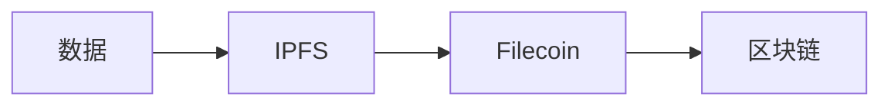

信息存证系统是TruthValidator的基础设施支柱。所有验证过程中产生的数据，包括原始内容、AI分析报告、投票记录和最终结论，都会通过内容寻址方式存储在IPFS网络中，生成唯一的CID哈希。这些CID指针随后被注册到Filecoin网络进行长期存储保障，通过智能合约自动续约存储交易，确保数据永久可用。为了进一步保证数据的抗审查性，系统采用了地理分布式存储策略，将数据碎片加密后存储在全球不同区域的存储节点上。区块链层则记录了完整的验证过程元数据，包括时间戳、参与方和关键决策点，形成不可篡改的审计线索。这种分层存储架构既满足了大规模数据存储的经济性要求，又确保了关键元数据的绝对可信。

## **4. 技术实现**

### **4.1 模块详解**

**智能合约**

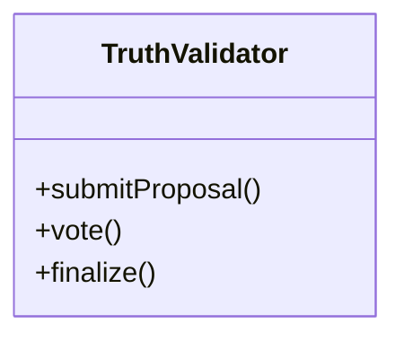

TruthValidator的智能合约系统采用模块化设计，核心合约负责管理验证提案的全生命周期。submitProposal方法处理用户提交的验证请求，包括内容哈希计算、费用收取和提案状态初始化。vote方法实现了复杂的投票逻辑，支持多种投票权重计算方式，并内置了防作弊检测机制。finalize方法则根据预设的共识规则确定最终验证结果，并触发结果通知和奖励分配。除了核心合约外，系统还包括信誉管理合约、代币经济合约和存储管理合约等辅助模块，共同构成了完整的去中心化验证协议栈。合约代码经过形式化验证和多轮审计，确保在各类边界条件下都能正确执行。

**AI工作流**

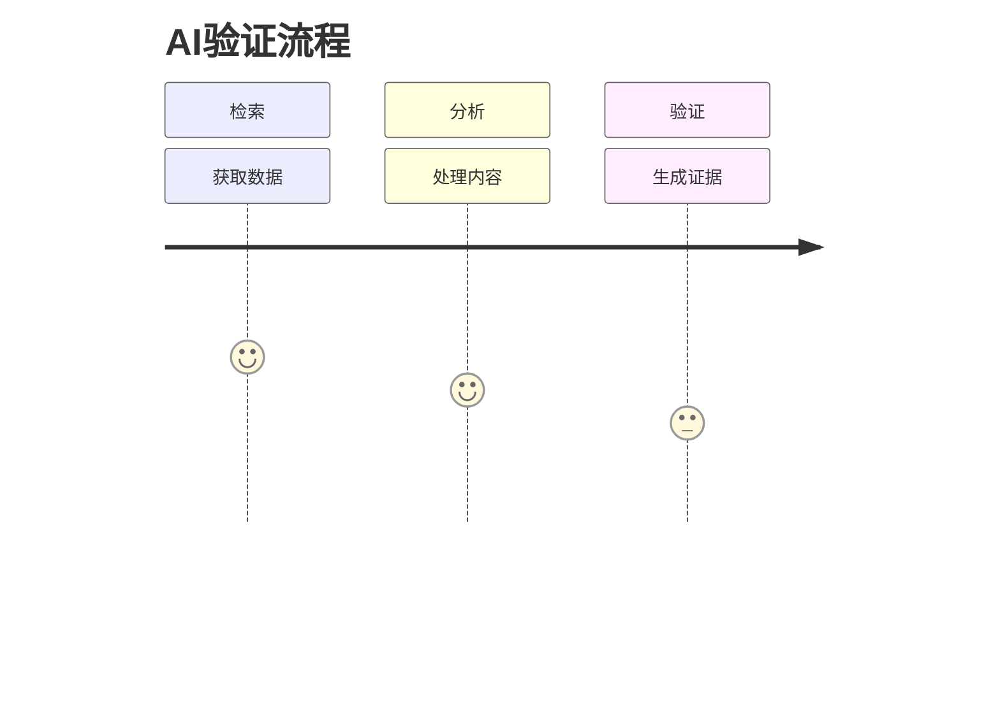

AI子系统的执行流程经过精心优化以实现效率与准确性的平衡。检索阶段首先对输入内容进行关键词提取和语义解析，然后并行查询多个知识源，包括权威数据库、学术期刊和经过验证的新闻档案，这一阶段通常占据整个处理时间的50%。分析阶段采用管道架构，依次进行事实性检查、逻辑一致性分析和信源可靠性评估，每个环节都生成详细的中间结果。验证阶段则综合所有分析结果，生成结构化验证报告，包括可信度评分、关键证据点和不确定性说明。整个流程采用异步微服务架构，可以根据负载动态扩展处理能力，确保系统在面对突发流量时仍能保持稳定响应。

### **4.2 关键技术**

TruthValidator整合了多项前沿技术以实现其设计目标。多模态内容分析技术使系统能够统一处理文本、图像、音频和视频内容，通过跨模态对比检测潜在的伪造痕迹。去中心化身份认证系统基于W3C的DID标准，为每位验证者建立可验证的数字身份，同时保护个人隐私。零知识证明技术的应用使得某些敏感内容的验证可以在不泄露原始信息的情况下进行，特别适合企业机密和个人隐私相关场景。跨链互操作性设计则通过桥接协议支持多区块链平台，用户可以选择在以太坊、Filecoin或其他兼容链上发起验证请求，系统会自动选择最经济高效的链完成交易处理。这些技术创新共同构成了TruthValidator区别于传统验证方案的技术护城河。

## **5. 应用场景**

### **5.1 典型用例**

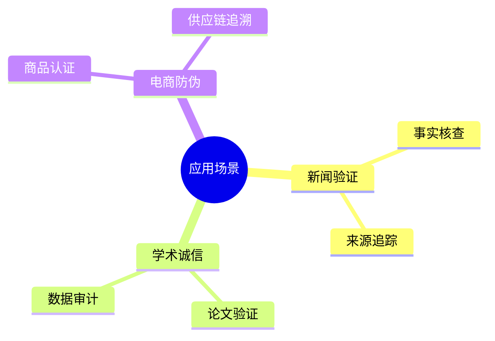

TruthValidator的应用场景覆盖了数字信息生态的多个关键领域。在新闻验证方面，媒体机构可以实时核查新闻报道中的关键事实，读者则可以追溯信息的原始来源，打破信息传播的"回音室"效应。学术领域应用包括研究论文的原创性验证和实验数据的真实性审计，帮助学术界建立更加透明的质量监督机制。电子商务平台可以利用该系统验证商品真伪和供应链信息，为消费者提供可靠的购物决策依据。此外，系统还适用于社交媒体内容审核、金融信息披露验证、法律证据保全等多个专业领域，几乎涵盖了所有对信息真实性有高要求的应用场景。随着技术的不断完善，TruthValidator有望成为互联网信息基础设施中不可或缺的信任层。

## **6. 生态发展**

### **6.1 路线图**

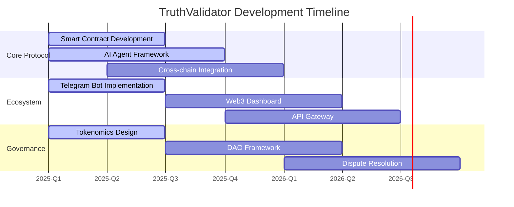

TruthValidator的发展遵循明确的阶段性规划，确保核心技术稳固的同时逐步扩展生态系统。在核心协议层，当前重点完善智能合约的安全性和性能优化，以及AI模型的准确率提升。生态系统建设方面，除了基础的用户接口开发外，正在构建面向开发者的API平台和数据分析工具，降低第三方集成门槛。治理模型的演进则采取渐进式去中心化策略，初期由核心团队引导，逐步过渡到完全由社区主导的DAO治理。每个发展阶段都设有明确的技术指标和社区里程碑，确保项目始终朝着既定的愿景稳步前进。这种务实的发展策略既保证了项目的可持续性，又为技术创新留出了充足空间。

## **7. 总结展望**

**技术价值**

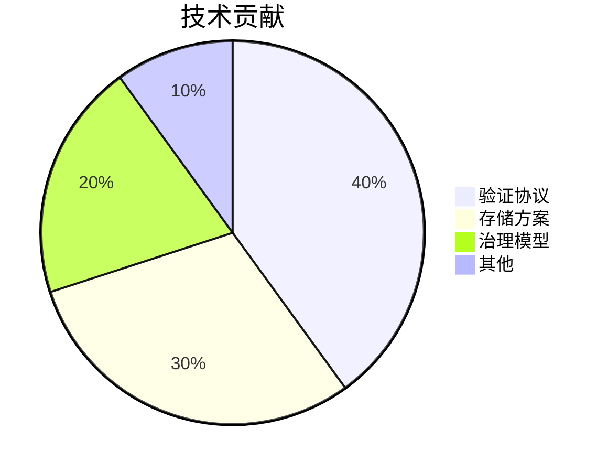

TruthValidator的技术创新主要体现在三个方面：首先是构建了完整的去中心化验证协议栈，定义了从内容提交到最终裁决的标准流程；其次是开发了与Filecoin深度集成的存储方案，解决了验证证据的长期保存问题；最后是设计了兼顾效率与公平的新型治理模型，为社区驱动的真相验证提供了可行框架。这些技术创新共同构成了项目40%的核心价值。存储方案贡献了30%的价值，解决了信息验证中最关键的证据保全问题。治理模型和其他创新则分别贡献了20%和10%的价值。

展望未来，TruthValidator计划在三个方向持续创新：扩展多链验证网络支持，使系统能够服务于更广泛的区块链生态系统；增强隐私保护功能，开发基于同态加密等技术的隐私保护验证方案；参与开放标准制定，推动去中心化验证协议成为行业通用标准。长期来看，TruthValidator有望发展成为数字信息领域的信任基础协议，如同TCP/IP之于互联网一样，为各类应用提供底层的真实性保障。正如项目宣言所言，其终极目标是"构建信息可信互联网的基础协议"，这一愿景正在通过持续的技术创新和社区建设逐步变为现实。

## **8. 参与方式**

TruthValidator是一个完全开源的项目，欢迎各类贡献者加入这一意义深远的事业。开发者可以通过GitHub参与核心代码开发或构建周边工具，当前优先开发的任务包括AI模型优化、跨链互操作性增强和用户界面改进。研究人员可以贡献在虚假信息检测、共识算法或密码学等领域的研究成果，帮助提升系统的技术先进性。普通用户则可以运行验证节点参与社区投票，或者简单地在日常使用中提供反馈帮助改进产品体验。项目采用开放治理模式，所有重大决策都通过社区讨论和投票确定，确保发展方向符合集体利益。通过官网可以获取最新开发动态，文档库提供了详细的技术规范和使用指南，社区论坛则是交流想法和寻求帮助的最佳场所。我们相信，只有通过广泛的社区参与和协作，才能真正实现构建可信互联网的宏伟目标。